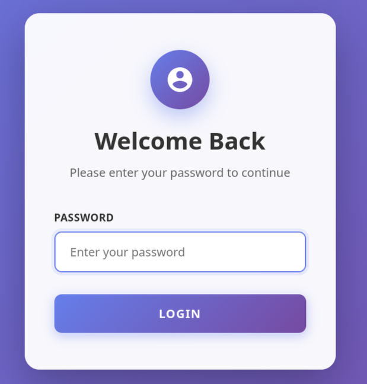
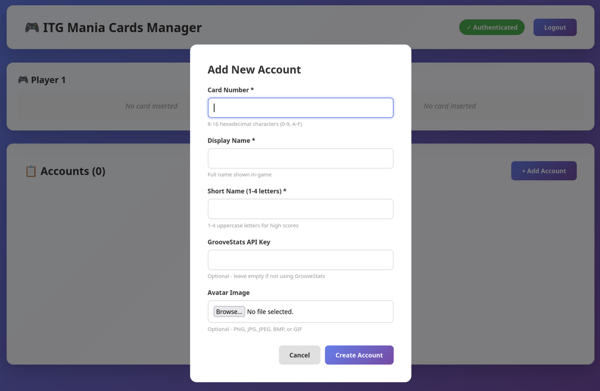
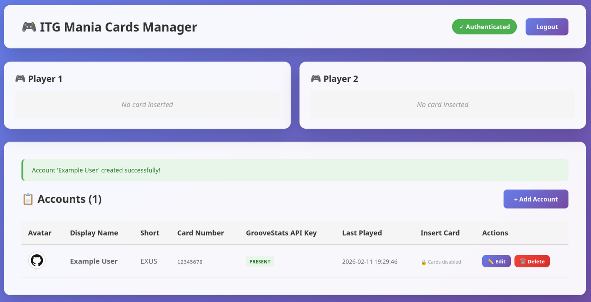

# ITGmania Cards Server

This project aims to replace ITGmania USB key profiles with NFC cards.

This project is for Linux only.

## How it works

### Web server

A web server is provided to manage the profiles.

The default port is `8000` and the default password is `admin`. Please take a look at the [configuration](#configuration) section to change these values.

Most of the web server code has been generated using Copilot because I suck at doing frontend.

### Unix socket server

A Unix socket server is provided for ITGmania to interact with this project.

The server can handle several commands, such as:
- `READ`: Read the currently inserted cards.
- `RESET <player>`: Remove the currently inserted card for the specified player (1 or 2).
- `ENABLE`: Allow the server to read the cards. This command is sent by ITGmania when the game is launched.
- `DISABLE`: Disable the server's ability to read the cards. This command is sent by ITGmania when the game is closed.

### NFC card reader

This is yet to be implemented, but the idea is to use two NFC card readers, one for each player, to read the cards and update which cards are inserted in the server.

For now, the cards can be manually inserted via buttons on the accounts list page in the web server.

The buttons are available only if the server is enabled, which means that ITGmania has been launched and has sent the `ENABLE` command.

## Installation

### Prerequisites

- Rust
- All prerequisites in https://github.com/ITGmania/ITGmania/tree/release/Build

### Build and run

#### This project

```bash
cargo run
```

or

```bash
cargo build --release
```

If you build the project in release mode, don't forget to copy the `config.toml` and `Rocket.toml` files to the same directory as the executable.

#### ITGmania

In the ITGmania sources, copy [MemoryCardDriverThreaded_Linux.cpp](./patch/MemoryCardDriverThreaded_Linux.cpp) to `src/arch/MemoryCard` and replace the existing file.

Then, build ITGmania (https://github.com/ITGmania/ITGmania/tree/release/Build).

In ITGmania's Preferences.ini, change the following values:

```
MemoryCardProfiles=1
MemoryCardUsbBusP1=1
MemoryCardUsbBusP2=2
```

### Configuration

The password hash is stored in `config.toml` at the same level as the executable.

The server configuration is stored in `Rocket.toml` at the same level as the executable.

## Screenshots





